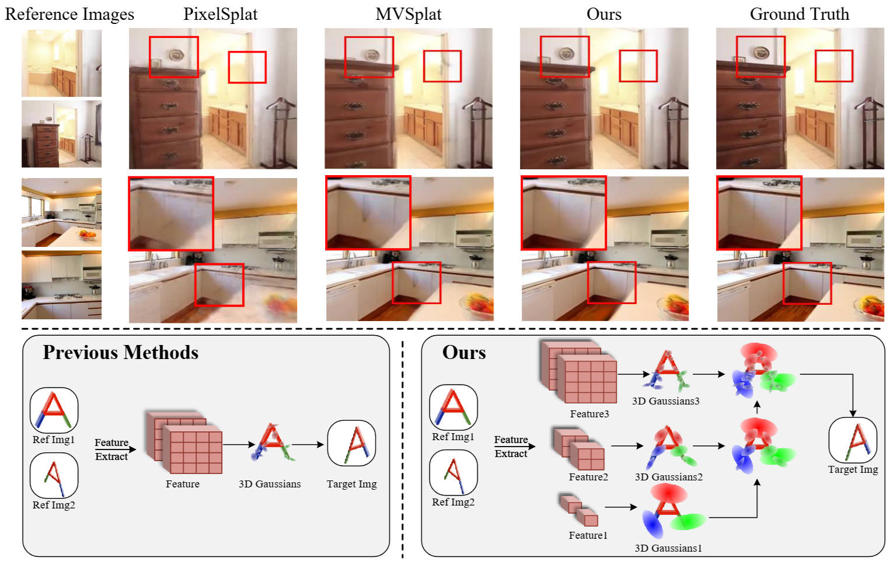

# HiSplat + MSH — Feature-Space 압축을 결합한 일반화 가능 Sparse-View 3D Gaussian Splatting

졸업 프로젝트. ICLR 2025 논문 **HiSplat**(Hierarchical 3D Gaussian Splatting for Generalizable Sparse-View Reconstruction)의
feature 경로에 학습형 codec(**MSH**, Mean-Scale Hyperprior)을 stage 단위로 삽입하여,
**낮은 bitrate에서도 novel-view 렌더 품질을 유지**하는 것을 목표로 한다.

> 베이스 모델은 원저자 구현([Project Page](https://open3dvlab.github.io/HiSplat/) · [Paper](https://arxiv.org/pdf/2410.06245))을 사용하며,
> 이 저장소는 그 위에 per-stage 압축 코덱을 통합한 확장 버전이다. 원 HiSplat 파이프라인 그림:



---

## 1. 프로젝트 목적

HiSplat은 2장의 reference view만으로 unseen scene의 3D Gaussian을 feed-forward로 예측하는 일반화 모델이다.
이 과정에서 encoder는 고차원 feature를 만들어 Gaussian 파라미터를 회귀하는데, **이 feature 자체가 큰 용량을 차지**한다.

본 프로젝트는 다음을 검증한다.

- HiSplat의 feature 경로에 학습형 entropy codec을 끼워 **feature를 압축**할 수 있는가?
- 압축으로 인한 렌더 품질 손실이 얼마이며, **얼마만큼의 rate 절감**과 맞바꾸는가?
- 품질 손실의 **원인이 무엇인가** (학습 부족 / 코덱 용량 / 코덱 구조) — 단일 변수로 귀인.

**최종 산출물은 단일 PSNR이 아니라 RD(rate–distortion) 곡선**이다.
즉 "압축 크기(KB) ↔ 렌더 품질(PSNR/SSIM/LPIPS)"의 trade-off 곡선이 핵심 결과물이다.

---

## 2. 사용한 방법론

| 항목 | 결정 |
|---|---|
| 베이스 | HiSplat (RealEstate10K pretrained, `hisplat_re10k.ckpt`) — HiSplat 본체는 **frozen** |
| 압축기 | per-stage **Mean-Scale Hyperprior (MSH)** — CompressAI 기반 학습형 codec |
| 삽입 위치 | 각 stage의 `proj_feat_in_fullres` feature (`codec_input=proj`), Gaussian 회귀 직전 |
| 학습 phase | `warmup`(코덱만 학습, HiSplat frozen) → `finetune` → `cooldown` |
| 목적함수 | render distortion + LIC-style rate + feature recon (아래 §3.3) |
| RD 축 | x축 = **절대 압축 크기(KB/scene)**. bpp 분모 불일치 회피를 위해 분모-free KB로 통일 |
| 평가 모드 | `forward`(STE로 압축 feature 렌더, estimated rate) / `compress`(실제 arithmetic coding round-trip, real rate) |
| 귀인 전략 | 품질 gap을 **학습량 / 구조(depth) / 용량(M)** 의 단일 변수 rescue ablation으로 분해 |
| 제외 | image-space distillation은 범위에서 **명시적으로 제외** (원 졸프 목표 이탈) |

---

## 3. 모델 아키텍처 (상세)

### 3.1 베이스 HiSplat (frozen)

- **Encoder — `EncoderCostVolumePyramid`** (`src/model/encoder/encoder_costvolume_pyramid.py`)
  - Backbone: **DINOv2 ViT-B**(frozen) + **multi-view transformer**(unimatch `gmdepth`/scannet 가중) → cross-view feature matching
  - Cost-volume 기반 multi-view depth predictor (`costvolume/depth_predictor_multiview.py`)
  - **3-stage coarse-to-fine 피라미드**(stage0/1/2): 각 stage가 자기 해상도에서 독립적으로
    `convert_to_gaussians_single_stage`로 Gaussian을 생성 (누적 concat 아님)
  - HiSplat 고유 모듈: **Error Aware Module**(Gaussian 보상) + **Modulating Fusion Module**(Gaussian 보정)으로 stage 간 상호작용
  - 규모(근사): 전체 ~204M / 원 학습가능 ~118M / frozen(DINOv2) ~86.6M
- **Decoder — `DecoderSplattingCUDA`** (`src/model/decoder/decoder_splatting_cuda.py`)
  - CUDA 미분가능 3DGS rasterizer, **파라미터 0개**

### 3.2 삽입된 압축기 — per-stage `StageMeanScaleHyperprior`

코드: `src/model/encoder/compression/stage_hyperprior.py`.
3개 stage 각각에 **독립적인** MSH 코덱이 붙고, 해당 stage의 `proj_feat_in_fullres`(입력 채널 = stage별 proj 채널)만 통과한다.
삽입 지점은 `depth_predictor_multiview.py`의 `_apply_codec()` (codec_input=`proj`일 때 proj feature를 in-place로 대체).

한 stage 코덱의 구성:

- **Analysis transform `g_a`**: `analysis_depth`개의 `Conv2d(·, ·, 5, stride=2, pad=2)` 스택.
  마지막을 제외한 각 층에 **GDN** 비선형. 채널은 `in → N → … → M`.
  stride-2가 `analysis_depth`번 → **공간 해상도 2^depth 다운샘플**(depth=4 → 16×, depth=2 → 4×).
  각 층에 보조 분기 **`WLS`(AuxT_enc)** 가 학습형 sigmoid gate(`enc_aux_gates`)로 main 경로에 가산.
- **Synthesis transform `g_s`**: `ConvTranspose2d` 미러 스택 + inverse GDN + 보조 분기 **`iWLS`(AuxT_dec)** + `dec_aux_gates`. → `x_hat` 복원.
- **Hyper-prior**: `h_a`(M→N, stride-2 conv 스택)로 hyper-latent `z` 생성, `h_s`로 `z_hat`에서 `(scales, means)` 산출.
- **Entropy 모델**:
  - hyper-latent `z`: `EntropyBottleneck(N)` (factorized)
  - main latent `y`: `GaussianConditional` — mean-scale 조건부, STE(straight-through) 양자화 `quantize_ste(y - means) + means`
  - rate: `calc_bits(likelihoods)`로 `y_bits`, `z_bits` 추정 → `estimated_bits = {y, z}`
- **stage 설정 (기본/anchor)**: `N=[192,192,192]`, `M=[320,320,320]`, `analysis_depth=[2,4,4]`

코덱 동작 모드(`codec_mode`):

| 모드 | 동작 | 용도 |
|---|---|---|
| `forward` | 렌더가 `x_hat`(STE) 통과 — 실제 압축 운영점 | 학습(finetune)·forward 평가 |
| `bypass` | 렌더는 원본 feat, 코덱은 recon·rate만 오프라인 계산 | warmup(코덱 단독 학습) |
| `compress`/`decompress` | `entropy_bottleneck`·`gaussian_conditional`의 실제 arithmetic coding round-trip | real-bytes RD 측정 (`test.compress=true`) |

### 3.3 학습 목적함수 (`src/model/model_wrapper.py`)

```text
total = Σ_i ( mse_i + lpips_i )            # render distortion (bypass stage는 제외)
      + λ_rd · ( Σ_i estimated_bits_i ) / (b · v · h · w)   # LIC-style rate (단일 분모)
      + recon_w · Σ_i codec_recon_i        # feature-space MSE(x_hat, feat.detach()) / feat_energy
```

- 3 phase: **warmup**(pretrained 로드, 코덱만 학습 — HiSplat frozen, 선택적으로 codec을 렌더에서 bypass) →
  **finetune**(HiSplat+MSH split-LR 공동 학습) → **cooldown**(LR 감소 후 지속).
- 옵티마이저 3분할: codec / aux(entropy bottleneck quantile) / generator, codec LR warmup 적용.
- RD 곡선의 x축은 분모 의존을 피해 **절대 KB**로 보고: estimated = `Σ calc_bits / 8 / 1024`,
  real = `Σ payload bytes / 1024` → 두 축이 자동으로 같은 KB 스케일.

---

## 4. 지금까지 나온 성능 (RealEstate10K, full test)

> 모두 동일 파이프라인·동일 test set에서 비교한 값. estimated rate 단위 주의(아래 caveat 참조).

**(a) 품질 천장 & gap**

| 설정 | PSNR | SSIM | LPIPS | 비고 |
|---|---|---|---|---|
| Vanilla HiSplat (압축 없음) | **27.194** | 0.8817 | 0.1170 | 천장선 |
| MSH anchor (M320, depth[2,4,4], near-lossless) | 26.916 | 0.8768 | 0.1248 | vanilla 대비 **−0.278 dB** |

**(b) gap 원인 귀인 — rescue ablation (각 30k step, 단일 변수)**

| arm | 변경 | PSNR | 해석 |
|---|---|---|---|
| ① 학습량 | M320, depth[2,4,4]를 30k까지 연장 | 26.974 (평탄) | 학습 부족 **아님** (5k 대비 +0.04만) |
| ② 구조 | **depth [2,2,2]** (16×→4× 다운샘플) | **27.162** (SSIM 0.8814 / LPIPS 0.1178) | vanilla 대비 −0.032 → 사실상 도달, 단 rate 약 **9×** 증가 |
| ③ 용량 | **M [512,512,512]** | 27.062 (미수렴, 상승 중) | 용량 효과 작음 |

→ **결론: −0.28 dB의 주범은 코덱 AE transform의 16× 공간 다운샘플(depth[2,4,4])**.
학습량·용량이 아니다. depth를 줄이면 vanilla 품질에 도달하지만 **압축률을 ~9× 잃는다** =
"화질 ↔ 압축 크기"가 이 코덱의 본질적 trade-off.

**(c) RD shape — λ-sweep probe (forward eval, step 15k)**

| λ | estimated KB | PSNR | 해석 |
|---|---:|---:|---|
| 0 | 304.1 | 26.418 | rate penalty 없음 |
| 0.02 | 1.44 | 25.909 | 약 200× 압축에 −0.5 dB |
| 0.2 | 0.134 | 25.523 | 극저율 sanity point |

- RD 관심 구간은 `λ∈(0, 0.02)`에 몰려 있음 → 최종 grid는 `λ∈{0, 0.001, 0.003, 0.007, 0.012, 0.02}`.
- eval `estimated_kb`가 곡선용 기준값이다. training log의 `estimated_kb`는 batch/random crop 차이 때문에 약 14× 다르게 보일 수 있다.
- rescue의 KB 절대값(①~1.2MB / ②~11MB / ③~1.9MB)은 λ=0 near-lossless라 **RD 곡선점이 아님**(품질 귀인 전용).

**(d) real-bytes 검증 — compress/decompress 실제 산술부호화**

| job | 설정 | PSNR | KB | 결론 |
|---|---|---:|---:|---|
| 345396 | λ=0.02, step 15k, `test.compress=true` | 25.904 | 1.5071 | forward estimated와 PSNR −0.005 dB, KB +4.7% |

real decode 폭발 원인은 `decompress()`에서 `h_s(z_hat)`를 재계산할 때 생긴 cuDNN 1-ULP 수준의 `scales` 흔들림이었다.
이 흔들림이 `GaussianConditional.build_indexes(scales)`의 CDF index를 1칸 바꾸고 range decoder bitstream을 desync했다.
`stage_hyperprior.py`는 compress/decompress 양쪽에서 `scales`를 1/1024 격자로 snap하여 index를 안정화한다.

---

## 5. 진행 상황

- [x] HiSplat 본체에 per-stage MSH 코덱 통합 (`StageMeanScaleHyperprior`, codec_input=`proj`)
- [x] warmup/finetune/cooldown 3-phase 학습 파이프라인 + split-LR 옵티마이저 + slurm 스크립트
- [x] forward / bypass / compress·decompress 평가 경로, KB 기반 RD 메트릭 산출
- [x] render-path finetune 라인 종료 (train-scene 과적합으로 net-negative 확인)
- [x] **품질 gap 귀인 종결**: −0.28 dB는 코덱 다운샘플 depth가 지배 (rescue 3-arm 결정적)
- [x] **probe λ-sweep RD shape 확정**: 9/9 forward eval 완료, 관심 grid를 작은 λ 구간으로 축소
- [x] **real-bytes 검증 종결**: scale snap 후 6474-scene `compress=true` 완주
- [ ] **진행 중**: 50k λ-sweep 본실험 후 forward estimated + real compressed KB 2-컬럼 RD 곡선 작성
- [ ] capacity frontier(M={96,128,192,256,320}) 동질 프로토콜로 frontier 확정

### 알려진 함정 (운영 주의)

- `LAMBDA_RD>0`이면 `CODEC_TRAIN_MODE=full`(또는 `entropy`) 필수 — 아니면 rate 항이 조용히 누락(스크립트 가드 있음).
- warmup+bypass의 `val/psnr`는 압축에 **장님**(원본 feat 렌더). 실제 RD는 frozen ckpt를 별도 forward/compress 평가로만 측정.
- ckpt monitor가 `global_step` 기준이라 `SAVE_TOP_K=1`은 best가 아닌 **최신 step**만 저장 → 비교 run은 `SAVE_TOP_K=-1` + 오프라인 best 선택.
- `VAL_INTERVAL`은 epoch당 train batch 수 이하여야 함(초과 시 setup 단계에서 즉사).
- `build_indexes(scales)`는 scale-table 경계에서 매우 민감하다. real entropy coding 경로는 scale snap을 compress/decompress 양쪽에 대칭 적용해야 한다.
- 클러스터 W&B service timeout 방지를 위해 slurm 기본값은 `WANDB_MODE=disabled`다. 필요할 때만 명시적으로 `WANDB_MODE=offline/online`으로 바꾼다.
- 다른 checkout/클러스터 배포 시 `src/model/encoder/compression/stage_hyperprior.py`의 scale snap 패치가 실제로 들어갔는지 `grep _build_stable_indexes`로 확인한다.

---

## 🏡 설치

```bash
conda create -n hisplat python=3.10
conda activate hisplat
pip install torch==2.1.2 torchvision==0.16.2 torchaudio==2.1.2 --index-url https://download.pytorch.org/whl/cu118
pip install -r requirements.txt
```

체크포인트(베이스 HiSplat·DINOv2·unimatch)는 `./checkpoints` 아래에 둔다.

```bash
wget 'https://s3.eu-central-1.amazonaws.com/avg-projects/unimatch/pretrained/gmdepth-scale1-resumeflowthings-scannet-5d9d7964.pth'
mv gmdepth-scale1-resumeflowthings-scannet-5d9d7964.pth ./checkpoints
wget 'https://dl.fbaipublicfiles.com/dinov2/dinov2_vitb14/dinov2_vitb14_pretrain.pth'
mv dinov2_vitb14_pretrain.pth ./checkpoints
mv hisplat_re10k.ckpt ./checkpoints   # 베이스 HiSplat (re10k) — RealEstate10K 데이터 준비는 원 HiSplat 안내 참조
```

RealEstate10K/ACID/DTU/Replica 데이터 준비는 원 HiSplat / MVSplat / pixelSplat 안내를 따른다(이 저장소는 RealEstate10K로 검증).

## 🏃 실행

### 베이스 HiSplat (압축 없음)

```bash
# 데모: 두 장의 context 이미지에서 novel-view 비디오 생성
python demo.py +experiment=re10k mode=test output_dir=temp checkpointing.load=./checkpoints/hisplat_re10k.ckpt
# RealEstate10K 테스트 (2-view)
python -m src.main +experiment=re10k checkpointing.load=./checkpoints/hisplat_re10k.ckpt mode=test \
  dataset/view_sampler=evaluation dataset.view_sampler.index_path=assets/evaluation_index_re10k.json \
  test.compute_scores=true output_dir=test_re10k
```

### HiSplat + MSH (압축기 학습/평가)

slurm 스크립트가 모든 코덱 설정을 환경변수로 받는다.

```bash
# 학습 (warmup: HiSplat frozen, 코덱만 학습)
PHASE=1 CODEC_TRAIN_MODE=full LAMBDA_RD=0.0 \
CODEC_STAGE_N=[192,192,192] CODEC_STAGE_M=[320,320,320] CODEC_STAGE_DEPTH=[2,4,4] \
OUTPUT_NAME=msh_proj_full_run sbatch scripts/train_hisplat_msh.slurm

# 평가 — forward (STE 압축 feature 렌더, estimated KB)
CKPT=outputs/msh_proj_full_run/checkpoints/epoch_0-step_15000.ckpt \
TEST_COMPRESS=false OUTPUT_NAME=eval_forward sbatch scripts/eval_hisplat_msh_compress.slurm

# 평가 — compress (실제 arithmetic coding round-trip, real KB)
CKPT=outputs/msh_proj_full_run/checkpoints/epoch_0-step_15000.ckpt \
TEST_COMPRESS=true OUTPUT_NAME=eval_compress sbatch scripts/eval_hisplat_msh_compress.slurm
```

평가 시 학습에 쓴 `CODEC_STAGE_M`/`CODEC_STAGE_DEPTH`를 **명시적으로 동일하게** 넘겨야 한다(불일치 시 크래시).
기본 W&B 모드는 `disabled`이며, 디버그용 codec roundtrip 로그가 필요할 때만 `MSH_CODEC_DEBUG=1`을 켠다.

---

## BibTeX (베이스 HiSplat)

```bibtex
@article{tang2024hisplat,
  title={HiSplat: Hierarchical 3D Gaussian Splatting for Generalizable Sparse-View Reconstruction},
  author={Tang, Shengji and Ye, Weicai and Ye, Peng and Lin, Weihao and Zhou, Yang and Chen, Tao and Ouyang, Wanli},
  journal={arXiv preprint arXiv:2410.06245},
  year={2024}
}
```

## ⭐ Acknowledgements

베이스 모델 [HiSplat](https://open3dvlab.github.io/HiSplat/) 및 그 기반인
[MVSplat](https://github.com/donydchen/mvsplat), [PixelSplat](https://github.com/dcharatan/pixelsplat),
[MVSFormer++](https://github.com/maybeLx/MVSFormerPlusPlus), 그리고 학습형 codec 구현의 기반인
[CompressAI](https://github.com/InterDigitalInc/CompressAI)에 감사드린다.
